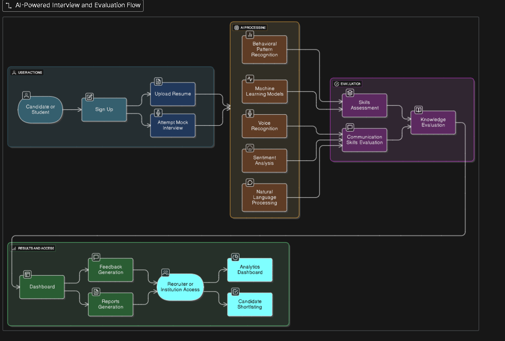

# 🎙️ AI Voice App   

An intelligent AI-powered voice assistant application built with cutting-edge web technologies.  
Originally developed by **Ronit**, extended and improved collaboratively by **Anurag & Riya** for **SIH 2025**.

---

## 🚀 Features
- 🎤 Voice command recognition
- 💡 Smart task execution (search, open apps, reminders, etc.)
- 🌐 Web integration (Google, Wikipedia, YouTube APIs)
- 🤖 AI/ML model for natural response generation
- 🎨 User-friendly UI

---

## 🛠️ Tech Stack
- **Frontend:** React.js, Tailwind CSS
- **Backend:** Node.js, Express
- **AI/ML:** Python, SpeechRecognition, OpenAI APIs
- **Database:** MongoDB
- **Version Control:** Git & GitHub

---

## 📂 Project Structure
Ai-Voice-App/
│── frontend/ # React + Tailwind frontend  
│── backend/ # Node.js API server  
│── models/ # AI/ML models  
│── docs/ # Documentation & diagrams  
│── README.md # Project documentation

---

## 🎯 SIH 2025 Goals
- Enhance accuracy of voice recognition
- Add **multi-language support (English + Hindi)**
- Build **offline mode** for rural accessibility
- Improve UI/UX for better usability
- Deploy live demo (Heroku/Vercel)

---

## 👨‍💻 Team Members
- **Anurag Kumar** – Full Stack + AI Innovator
- **Riya** – UI/UX & Testing Lead
- **Ronit** – Initial Developer & Mentor

---

## 📸 Screenshots / Diagrams

---

## 📜 License
This project is licensed under the MIT License – free to use and improve.